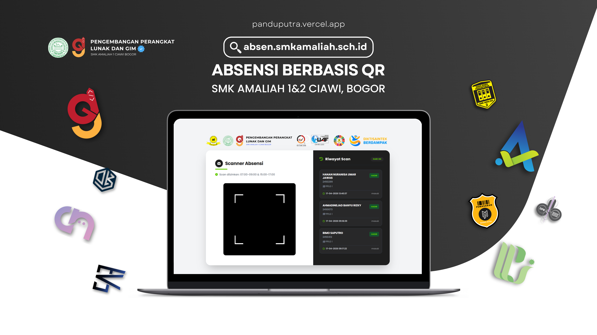
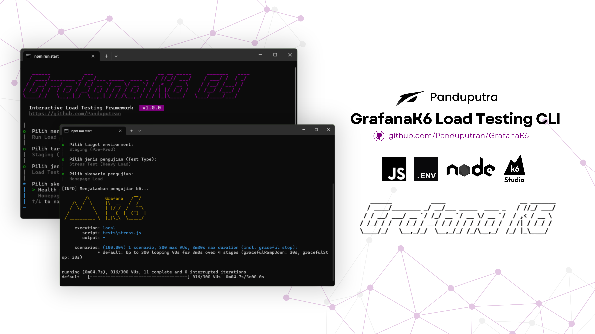
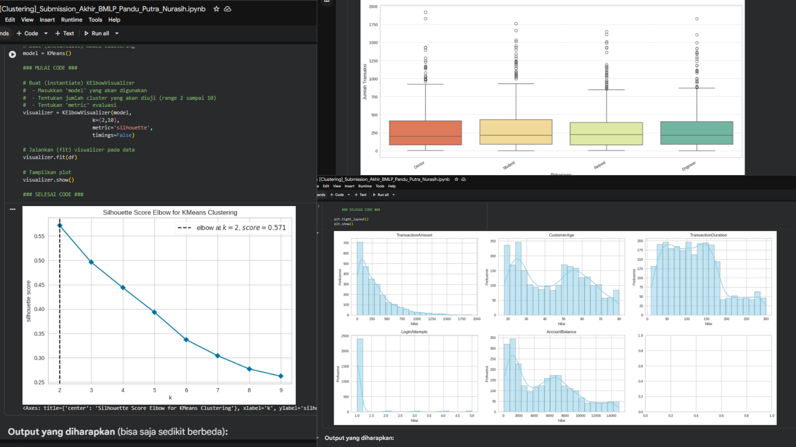

<!-- Banner Section -->

<!-- Featured Projects Section -->
<h3 align="left">Featured Projects</h3>

<table border="0" width="100%" cellspacing="0" cellpadding="2">
  <!-- Row 1: SMK, QR, Grafana, BMLP -->
  <tr>
    <td width="25%">
      
    </td>
    <td width="25%">
      
    </td>
    <td width="25%">
      
    </td>
    <td width="25%">
      
    </td>
  </tr>

  <!-- Row 2: Portofolio, Stackup, Buildtrack, Warghe -->
  <tr>
    <td width="25%">
      
    </td>
    <td width="25%">
      
    </td>
    <td width="25%">
      
    </td>
    <td width="25%">
      
    </td>
  </tr>
</table>

<!-- Certifications & Badges Section -->
<h3 align="left">Certifications & Badges</h3>

<table border="0" cellspacing="0" cellpadding="0">
  <tr>
    <td style="padding-right: 14px;">
      
    </td>
    <td style="padding-right: 14px;">
      
    </td>
    <td style="padding-right: 14px;">
      
    </td>
    <td style="padding-right: 14px;">
      
    </td>
    <td style="padding-right: 14px;">
      
    </td>
  </tr>
</table>
<h3 align="left">Google Developer Program</h3>

<h3 align="left">Google Developer Program</h3>

<table border="0" cellspacing="0" cellpadding="0">
  <tr>
    <td style="padding-right: 14px; padding-bottom: 14px;">
      
    </td>
    <td style="padding-right: 14px; padding-bottom: 14px;">
      
    </td>
    <td style="padding-right: 14px; padding-bottom: 14px;">
      
    </td>
    <td style="padding-right: 14px; padding-bottom: 14px;">
      
    </td>
    <td style="padding-right: 14px; padding-bottom: 14px;">
      
    </td>
    <td style="padding-right: 14px; padding-bottom: 14px;">
      
    </td>
    <td style="padding-right: 14px; padding-bottom: 14px;">
      
    </td>
  </tr>
  <tr>
    <td style="padding-right: 14px;">
      
    </td>
    <td style="padding-right: 14px;">
      
    </td>
    <td style="padding-right: 14px;">
      
    </td>
    <td style="padding-right: 14px;">
      
    </td>
  </tr>
</table>

<!-- 1. Terminal / ASCII Profile Card -->
<picture>
  <source media="(prefers-color-scheme: dark)" srcset="./profile-dark.svg?v=2">
  <source media="(prefers-color-scheme: light)" srcset="./profile-light.svg?v=2">
  
</picture>

<!-- 2. Contribution Activity Graph -->

  

<!-- 3. Streak Stats (GitHub Green Theme) -->

  

